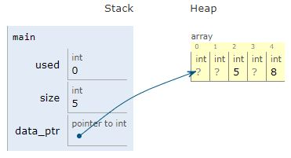

# `Object Oriented Programming CPP`

Sir Mohsin Ansari  
[Lecture-10-end Container Classes](https://www.youtube.com/watch?v=qpcpjy7G5yw&list=PL0OILbU3zRoDJo6H9WS1vEfBzlEZQKJD1&index=12)

---

## `Table of Contents`

1. [Bag_Class](#bag_class)
2. [Heap_Memory](#heap_memory)
3. [Operator_Overloading](#operator_overloading)
4. [Dynamic_Memory](#dynamic_memory)
5. [Dynamic_Binding_And_Static_Binding](#dynamic_binding_and_static_binding)

---

## `Bag_Class`

### `Bag Operations`

- A bag can put in it's **initial state**, which is an **empty bag**.
- Number can be **inserted** into the bag.
- We may **count** how many occurrence of a certain number are in the bag.
- Numbers can be **erased** from the bag.
- We can check the **size** of the bag.
- We can **remove** a number from a bag. But we remove only one number at a time.

**Why need pointers for bag?**  
If the size of your bag is not known at compile time or if it changes dynamically during program execution, using pointers allows you to allocate memory on the heap using new. This can be useful when you want to manage memory more flexibly.  
Pointers can be assigned a null value (nullptr), allowing us to represent the absence of an object in the bag.

Bag class is nothing, It's a just manipulation of an array.

### `Heap_Memory`

Heap memory, often referred to simply as the "heap," is a region of a computer's memory that is used for dynamic memory allocation. Unlike the stack, which is used for function call management and local variables, the heap is a more flexible area of memory that can be used to allocate memory at runtime. The heap allows programs to allocate memory for variables whose size is not known until the program is running or for data structures like arrays and linked lists.

---

In bag class we just store an array of integers. In that array we can insert, delete, update values/integers.  
*Simply declaring a function is called **prototyping**.*
**One big advantage of OOP is that we can easily convert our requirements into code, without much thinking about it's implementation, we only focus on prototyping not on it's implementations. While in normal way of programming we must have to implement as well with prototyping one by one.**  
If we have not initialized an array, and we want to retrieve then it'll give us a garbage values.

```C++
#include <iostream>
using namespace std;

class bag{
  private:
    int data[20];
    int used;   // it tells how much our array is used. so if here 0 stored then we are at 0 index. array is empty.
    // instead of initializing data array itself. we just initialize the used variable. It tells us about array.


  public:
    // constructor
    bag(){
      used = 0;
    } 

    bool insert(int value){
      if(used==20){
        return 0;
      }else{
        data[used]=value;
        used++;
        return 1;
      }
    }

    int bagSize(){
      return used;
    }

    void clear(){
      used = 0;
    }

    bool checkValInBag(int value){
      if(used == 0){
        cout<< "Not found As bag is empty.";
        return 0;
      }else{
        for(int i=0;i<used;i++){
          if(value==data[i]){
            cout <<value << " Has been found at index " << i << endl;
            return 1;
          }
        }
        cout<< "Not found.";
        return 0;  
      }
    }

    // Occurrences of a specified number in array.
    int howMany(int value){
      if (used == 0){
        cout<<"Bag is empty."
        return 0;
      }
      int count = 0;
      for(int i=0;i<used;i++){
        if(value == data[i]){
          count++;
        }
      }
      return count;
    }

    // To remove first swap with last element and then next--
    bool remove(int value){
      if(used == 0){
        cout << "bag empty";
        return 0;
      }

      for (int i = 0; i < used; i++){
        if (data[i] == value){
          data[i] = data[used - 1];
          used--;
          return 1;
        }
      }
      return 0;
    }

    bool removeDuplicate(int value){
       if(used == 0){
        cout << "bag empty";
        return 0;
      }

      for (int i = 0; i < used; i++){
        if (data[i] == value){

          if(data[used-1]==value){
            used--;
            i--;
          }else{
          data[i] = data[used - 1];
          used--;
          }
        }
      }
      return 1;
    }

  /* 
    bool checkDuplicate();
  */

    void display() {
      if(used == 0){
        cout << "Bag is empty" << endl;
      } else {
         for(int i = 0; i < used; i++){
          cout << data[i] << endl;
         }
      }
    }
}

int main(){

  bag b;

  if(b.insert(4)){
    cout << "Data successfully Inserted" << endl;
  }else{
    cout << "Bag is full" << endl;
  }


  return 0;
}

```

**During execution/run time we have no way of increasing or decrementing the size of any static array.** So here comes pointers and dynamic memory. **Pointer is all about memory location and memory management.**  
We'll convert this static bag into a dynamic bag with the help of pointer.

---

### `Operator_Overloading`

let's say we want to add(combine) two bag objects, basically we want merge two bags. We will combine the two bag objects and store the result in third bag. **bag b3=b+b2;** Here compiler error. because it will expect integers before and after addition operator. Because of we haven't, yet overloaded any operator.  
Now to add two bags, compiler shouldn't use the default + operator, Instead we'll built our own addition operator.

The compiler will convert this statement **b3=b+b;** into **b.operator+(b)** So here b is a calling object and b is a parameter object into operator+ function. As we know **we can access attributes of calling object directly in a functions of class** just like we did. And to access b we will pass as a parameter.

```  c++

class bag{
  private:
    int data[20];
    int used;  


  public:
  // All above functions...


  // Operator overloads
  bag operator+(bag b1){

    if(used + b1.used >= 20){ // here used is for calling used of object
    cout << "Addition is not possible" <<endl;
    }else{

    bag b3;
      for(int i=0; i<used; i++){
        // b3[i]=data[i];
        b3.insert(data[i]);
      }
      for(int i=0; i<b1.used;i++){
        b3.insert(b1.data[i]);
      }

    }
    return b3;
  }

}


bag b;

b.insert(2);
b.insert(3);
b.insert(6);
b.insert(20);
b.insert(1);
b.display();


bag b2;
b2.insert(4);
b2.insert(1);
b2.insert(5);
b2.insert(2);
b2.insert(9);
b2.display();

cout << "After Combining: ";
bag b3 = b + b2; // For now Error // before overloading
// b.operator+(b2)  // converted to this


```

---

## `Dynamic_Memory`

Now we want this bag to be dynamic. Bag should have a dynamic memory size. It should not full unless our system memory(RAM) not full. We also want if we remove some elements from this bag, so in array, then the reserved memory should also remove. Till now it's not possible, because this memory for bag is reserving by the compiler, which we called **static memory**. So we move to the **pointers** and **dynamic memory**.

**Limitations of our static bag class:**

- **Capacity is constant.** Every bag object will have a fixed capacity.
- **Wasteful if too big memory** is reserved, and **hard to reuse if too small** memory is reserved.
- To increase or decrease in size we need to **change in source code and recompile.** There no option to change the size during run time.

**Solution:**  

- Provide control over size in running time.
- **Dynamic Arrays**.
- **Pointers** and **Dynamic Memory**.

---

### `Concepts Pre-Requisites to Dynamic Memory`

1. [Pointers](#pointer)
2. [Static_Memory_VS_Heap_Memory](#static_memory_vs_heap_memory)
3. [Shallow_Copy_VS_Deep_Copy](#shallow_copy_vs_deep_copy)
    1. Copy Constructor
    2. Assignment Operator Overload
    3. Destructor

---

### `Static_Memory_VS_Heap_Memory`

**Static Memory:** Static Memory are those memory spaces that reserved by a compiler itself.  
**Heap Memory:** Heap Memory is a memory space where user defined memory are stored.

---

### `Shallow_Copy_VS_Deep_Copy`

There are two ways to copy values from one object to another.

1. using assignment operator, this process is called assignment operator.

    ```c++
    bag b;
    bag b2=b;
    ```

2. Passing an object into another object, The process of copying object value into another object with passing it as a parameter is called **copy constructor.**

    ```c++
    bag b;
    bag b2(b);
    ```

These both are not implemented in our code. We've not implemented assignment operator overloads nor we have one argument constructor, so we have not any constructor that have one argument, and data type that argument is object.

If we execute first one it's working correctly. So by default compiler will make a constructor with one argument, that constructor is called copy constructor. That constructor is working correctly.

Now if we execute second one, Again it's working correctly. This is working because if we do b2=b; then the compiler will put all the codes/data that are inside the memory location of b into b2, because b and b2 are simile type, and will occupy same memory space. compiler will not check for data in each block of memory. Copy constructor also doing the same. **This concept is called a Shallow copy**  
This copy is called shallow because here the data copying shallowly. Reason for that is it's not comparing the data deep inside of each memory block.

Let's Understand with simple example

```c++
int a = 10;
int c = a;
char b = a; // Type Miss match Error. Memory space for both int and char are not same.

```

Here⤴ compiler will take make a memory space according to the data type of c and then it'll copy the data from the memory location of a and paste it into the memory location of c. so a & b will be 10;

***`Attributes of any class will always takes different spaces for different objects. But functions will take common space for different objects. And during execution time the function will bound to the calling object.`***

**So to deep copy we use Pointer.** If our class contains some pointers then the shallow copy will not work correctly.

---

### `Pointer`

Spacial variable which stores addresses of variables.

- It provides dynamic memory, dynamic array, Dynamic objects etc
- Provides Heap memory

#### `Local_Variable`

int i;  
i = 42;  
 Here we're saying compiler that go to the static memory and there reserve a space for an integer, which is 4 bytes in 32-bit system. So the compiler will store 42 at a specific address in the static memory, and name that address to i as a user defined name. The compiler will generate a table, which we often call 'Memory Variable Table',  It may have two columns, in first one it will store user-defined name and in second column it will store RAM address.

To display address of any variable we write AND operator beside the variable name, like this **&i** To store this variable we use pointer

```C++
int a = 1;
int *b_ptr;
b_ptr = $a;
cout << &a << " " << b_ptr; // Should be same

cout << &b_ptr; // Now it'll print address of b_ptr, which is not equal to b_ptr, which is address  of a, stored in b_ptr as a value.

cout << *b_ptr; // Dereferencing operator // 1 // print the value on the address that stored in *b_ptr

int c = *b_ptr; // Dereferencing operator
cout << c; // 1

```

Here b_ptr is a special variable which store the address of the integer memory address.  

*\* use for ***pointer declaration*** and **dereferencing**.*

**Why we're using a pointer here? All this things we can do without using pointer.** Pointer needs in that situations where we have no way of creating a static memory, we utilize pointer. so for creating a dynamic memory during runtime we use pointer to store that address. like this.⤵ . Here we're not creating a static memory, we're just reserving 4 bytes of memory inside a heap memory, and store that address into a_ptr variable.  

***ACTUAL POWER OF POINTER COMES TO PLAY WHEN WE'RE WORKING WITH DYNAMIC MEMORY.***

```c++
int *a_ptr = new int;
```

---

`Lecture #13`

```js
int a[20];  // array
int *a_ptr = &a;

```

`⤴ Here we are storing an address of an array in a pointer, Here the point is that in this pointer we cannot increase or decrease the size of pointer dynamically. Because the memory of integer type array is reserved by compiler, we're just storing that address in a pointer. So this is not an actual use case of Pointer.`  
Till now we need any declared variable to initialize a pointer. As we're storing an address of any declared variable in a pointer. After that we're utilizing the pointer.

*So, **How to use a Pointer without connecting with a declared ordinary variable? Here Dynamic Variable comes!!***

---

### `Dynamic Variables`

Real power of pointer're utilized with Dynamic Variables without any identifiers. So we want to reserve a some memory space by self. So for that we use keyword **new**.

The purpose of `new keyword` is that it will give us dynamic reserved memory in Heap. just like this

```c++
int *a_ptr = new int;
```

**new operator do two things:**

1. Reserve memory in heap memory of type (int in this case -4byte)
2. After creating memory, new operator will return newly created memory address.

In other words, we can say **new operator is a special function which creates dynamic memory and return address of that memory.** As it's returning an address we should have to store in any pointer variable.

```c++
int *a_ptr = new int;
double *b_ptr = new double;
```

`Remember:` To reserved any memory space in static memory we always need any identifier/variable, because it reserved by compiler.  
Memory Variable Table[Identifier_Address](copy k last page)

here⤴ for **a_ptr itself reserve a static variable in stack memory, which will hold the address of dynamic memory created by new operator according to size of dataType.** Note here, There's no identifier against newly created dynamic memory by using new operator. For static memory there will always identifier in MVT.  

```cpp
int *a_ptr = new int
*a_ptr = 20;
 
cout << *a_ptr << endl; // 20
```

**How this value(20) stored in the address of dynamic memory?** To store 20 in a memory the compiler will check there is any identifier named as a_ptr in MVT, if there is then jump to that address in static memory. And as we wrote \* before a_ptr, the compiler will check if the a_ptr that stored in static memory is a pointer, yes, then it'll jump to that address, which stored in static variable. which is dynamic memory location. and will write 20 in that location. This all happens due to \* dereferencing operator.

Now we can delete this a_ptr memory during execution time.

```cpp
int *a_ptr = new int
*a_ptr = 20;
 
cout << *a_ptr << endl; // 20

delete a_ptr; // it will delete the memory address from static memory, which is address of dynamic memory.
cout << *a_ptr << endl; // garbage value // deleted

int b = 20;
delete b; // Error, reserved by compiler. and will delete by compiler


```

Count total memory of this⤴ program? So during compilation time there is a zero memory reserved for this code. reason for this that these memory will always reserved during execution time.  
***"Compile-time memory allocation is generally associated with variables that have static storage duration (e.g., global variables, static variables). These variables are allocated memory at compile time and retain their memory throughout the program's execution. In the case of int b = 20;, the memory for b is managed dynamically during runtime, and no memory is reserved for it at compile time."*** *Chat-GPT*

---

### `Dynamic_Binding_And_Static_Binding`

With the help of concept of dynamic memory during runtime we can create a memory and delete them.

```cpp
int a;
int b;

```

let's say we want to declare an array in dynamic memory(heap), so use new operator and then store that address into an integer type pointer

```cpp
int *a_ptr = new int[20];
int_ptr[2] = 20;
// cout << *a_ptr[2]; // was not correct
cout << a_ptr[2];

cout << *(a_ptr + 2); // same

// Now we can delete this complete array
delete a_ptr;
```

**How the compiler store 20 in index2? In other word how compiler reach to the index[2]?** Here in case of an array the new operator will return the address of first array element. So first the compiler check is there any variable in MVT, if there is then due to astrict(dereference operator) it will check the value at that memory address. So here the value is address of first index of array in heap, So firstly it will reach to the index of first index, But it's still not terminate because after that (*a_ptr) there is a square brackets around the 2. So here compiler add that 2 with the value of a_ptr, which is remember address of first index of array. let say 901 is address of first index of array, so it wll be like this: 901 + 2, So the compiler change this statement \***int_ptr[2] to *(901 + 2)** This plus operator is not a normal plus but it's an overloaded plus. So here it'll add two time 4 bytes as it's an integer type to go second index.

---

`Lecture #14`

```cpp
int size; // for initial size of array.
int *data_ptr; // to store address of a dynamic array
int used=0; // already used array size

cout << "Please enter size of an array in dynamic memory" << endl;
cin >> size;
data_ptr = new int[size]; 
// new will reserve a memory size of this array in heap, and return the address of fist index

// simply fill with random numbers
for(int i=0; i<size; i++){
  data_ptr[i]=1+rand()%100; // generate a random number between 1 and 100. stdlib.h include 
  used++;
}

// log
for(int i=0; i<used; i++){
  cout<<data_ptr[i]; // now these numbers comes from dynamic memory.
}

// At this point we realize that we need an array of size 10, but when initializing the size of the array we gave 5. To do that...

// 1) Create Temp memory
int *temp_ptr=new int[10];

// 2) To copy values from data array to temp
for(int i = 0; i < used; i++){
  temp_ptr[i] = data_ptr[i];
}

// 3) Delete data array
delete [] data_ptr; // now deleted. to delete array use []

// 4) Assign temp_ptr value to data_ptr
data_ptr=temp_ptr;

```

To increase the size of an array during run time we do these steps. [code⤴]

1. Create Temporary memory in heap
2. Copy actual value in this temporary variable.
3. Delete Actual Array
4. Store temp_ptr's value into data_ptr

`Explanation:`  
To increase the size of the array during run time, we will create a new array in heap as a temporary memory location. then we will store the actual data from our data array to the temp array at corresponding index. code ⤴. Now here we have two dynamic memory, one where temp is pointing and anther where data is pointing. Now after copying we delete the data array, because it's smaller than our requirement. To delete we use [] so it'll delete all the array indexes from heap. now data_ptr is pointing to somewhere in the heap, but there nothing exists, because we deleted. so there will be some garbage value.  
Right now our dta_ptr is free, and temp_ptr is pointing the array which is 10 array size. Now if we store the value of temp_ptr(which is 1st-index of large array) into data_ptr(which is free, right now). Then data_ptr will also start pointing at same memory address where temp_pts is pointing.

`These we can do with normal array as well, i-e increase the size of array by using temporary array. So what is difference that with this?`  
The difference is that during execution time we cannot free smaller array. The space for that array will reserve, until that static array goes out of scope.

*`Remember:` Delete means we're not deleting the reserved RAM memory, But we basically free the reserved memory, to utilize by other processes.*

Here in our Program there is a logical mistake, That is, **What happen if our static variable(data_ptr), where we stored address of dynamic memory, goes out of scope?** In this case the compiler will also delete the size variable, used, and also *data_ptr. The big problem here is we've a dynamic memory reserved in heap, but we cannot access it or even delete it. It'll reserved un till unless our system RAM/Pc restart.

So we always delete our dynamic memory before program termination.⤵

```cpp
delete []data_ptr;

return 0;
```

***`Dynamic memory always depends upon our system's RAM.`***

---

`Lecture  #15`

Now convert our static bag class to dynamic bag.  
To convert we need changes in constructor, insert function, remove function etc.  
In insert function, During insertion if the initial size of the bag is full then, we should increase the size of the bag, to do that we will create a new function, that will increase the size of the bag, and then in insert function we'll call that function. So after the bag is fulled, when user wants to insert new element, we just increase the size of the bag by one each time.

```cpp
if(bag.isFull()){
  reserve(size++);
}
```

### `Constructor for Dynamic bag`

First we start with implementing constructor. When ever an object is declared the constructor will called.

```cpp
bag(){
  used=0;
  size=5; // this is just the initial size, now we can increase/decrease during run time.
  data_ptr=new int[size]; // Reserve a space of given size in dynamic memory and sendBack the address of first element, and store into data_ptr
}
```

[Click_here_to_visualize_memory](https://pythontutor.com/visualize.html#mode=edit)

```cpp
int main() {
  int used=0;
  int size=5;
  int *data_ptr=new int[size]; 
  data_ptr[2]=5;
  data_ptr[4]=8;
  return 0;
}
```

`Visualization of this code⤴`  


---
We know that integer take 4 bytes, For pointer we need 8-bytes if system is 64-bit operating system. **The Question is what about a class? When we declare an object out of class then how much memory space will be allocated to that object?**  
For a simple class, I will depends on attributes in the class. In our case 4-bytes for size, 8-bytes for pointer(*data_ptr) and 4-bytes for used. so total size of our bag object will be 16-bytes. Remember here this 16-bytes is during compile time not during run time. So In stack there will be 16-bytes reserved. If we calculate both heap and stack then it may be 16 + (4 \* 5); size is 5  

```cpp
bag b1; // 16-bytes memory, during compile time // Total = 16 + (4 * 5)
```

`Remember:` Normal variable will always depends on what is the data-type of the variable, while pointer will depends on system-architecture(OS).

---

`Lecture #17`

Now at this point we can not add number of elements greater then 5, because we set initial size to 5. Although we created a dynamic array but till now there is no way to increase the array size, because we don't yet implemented reserve() function.

To increase the size dynamically, we can do is... When the used-size of an array is equal to initial size, then it's mean the array is already full, so we will add a function there, to increase the size of the array during runtime. We'll increase the size of the array by one, each time when a user wants to add new element. To increase the size of array, we use same logic and code that we wrote in previous lecture.  

Before adding reserve function we need to add destructor function, because we're creating a dynamic memory, so memory in heap, so we should've to delete that memory from heap. **To define destructure we use Tilde(~) sign before name, and the name will always name of class just like constructor. The constructor will call when object is created, and the destructor will call when object is destroyed or goes out of scope. Destructor will simply free all dynamic spaces.** If we don't specify the destructor function, then by default the one destructor function will be added to the class just like default constructor. **We can overload constructor but in case of destructor we cannot overload.** There will be only one destructor function, but still we can pass parameter to destructor. Most of the cased just use destructor function for delete dynamic memory that we created in class.  
**When Destructor is called?** Whenever any object is going to out of scope.

```cpp
// Destructor Function
~bag(){
  delete [] data;
}
```

---

#### `Implementing Reserve Function`

```cpp
void reserve(int capacity){
  int *temp=new int[size+capacity];

  for(int i=0;i<used; i++){
    temp[i]=data[i];
  }

  delete [] data;

  data=temp;
  size=size+capacity;
}

bool insert(int value){
  if(used==size){ // full
    reserve(size++); // 5+1 = 6
  }
}

```

In this function data and temp both are pointing to the same address in heap. But one very big difference is that **data is a class variable/attribute while temp is a local variable to this reserve function**, so it'll destroy as soon as returned from the function. By the way this function(reserve function) has two local variables, 1-temp, 2-capacity, which is parameter.

To decrease the size of dynamic array we just call the reserve function by using size -1

```cpp
reserve(size-1); // see remove function⤵.
```

---

`Final Code`

```cpp
#include <iostream>
using namespace std;

class bag{
  private:
    int size; // initial size of the bag
    int *data; // pointer to array(1st index), located in heap
    int used=0; // used array


  public:
    // constructor
    bag(){
      int used=0;
      int size=5;
      int *data_ptr=new int[size]; 
    } 

    void reserve(int capacity){
      int *temp=new int[capacity];

      for(int i=0;i<used; i++){
        temp[i]=data[i];
      }

      delete [] data;

      data=temp;
      size=capacity;
    }

    bool insert(int value){
      if(used==size){ // full
      reserve(size + 1); // 5+1 = 6
     } 
      data[used]=value;
      used++;
      return 1;
    
    }

    int bagSize(){
      return used;
    }

    void clear(){
      used = 0;
    }

    bool checkValInBag(int value){
      if(used == 0){
        cout<< "Not found As bag is empty.";
        return 0;
      }else{
        for(int i=0;i<used;i++){
          if(value==data[i]){
            cout <<value << " Has been found at index " << i << endl;
            return 1;
          }
        }
        cout<< "Not found.";
        return 0;  
      }
    }

    // Occurrences of a specified number in array.
    int howMany(int value){
      if (used == 0){
        cout<<"Bag is empty."
        return 0;
      }
      int count = 0;
      for(int i=0;i<used;i++){
        if(value == data[i]){
          count++;
        }
      }
      return count;
    }

    // To remove first swap with last element and then next--
    bool remove(int value){
      if(used == 0){
        cout << "bag empty";
        return 0;
      }

      for (int i = 0; i < used; i++){
        if (data[i] == value){
          data[i] = data[used - 1];
          used--;
          return 1;
        }
      }

      reserve(size-1);
      return 0;
    }

    bool removeDuplicate(int value){
       if(used == 0){
        cout << "bag empty";
        return 0;
      }

      for (int i = 0; i < used; i++){
        if (data[i] == value){

          if(data[used-1]==value){
            used--;
            i--;
          }else{
          data[i] = data[used - 1];
          used--;
          }
        }
      }
      return 1;
    }

  /* 
    bool checkDuplicate();
  */

    void display() {
      if(used == 0){
        cout << "Bag is empty" << endl;
      } else {
         for(int i = 0; i < used; i++){
          cout << data[i] << endl;
         }
      }
    }
}

int main(){

  bag b;

  b.insert(20);
  b.insert(10);
  b.insert(22);
  b.insert(11);
  b.insert(9);

  return 0;
}

```
